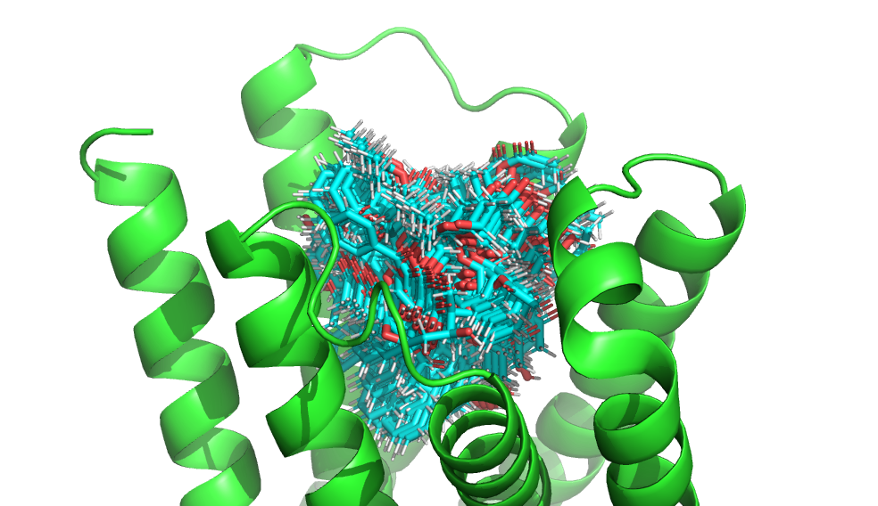

# Comprehensive Assessment of Rigid Poses Docking (CARPdock)

Can be used to quickly generate starting poses for [NISE](https://github.com/polizzilab/NISE).

This script performs rigid-body ligand docking onto an all glycine protein backbone using brute-force sampling of ligand rotations and translations, followed by clustering of valid poses. 
It loads protein and ligand structures, generates a grid of possible ligand positions, samples random ligand orientations, and filters out poses that clash with the protein or violate user-specified burial constraints. 
Valid ligand poses are clustered in 6D pose space (translation and rotation), and representative structures from each cluster can be written to output files. 
The script supports GPU acceleration with PyTorch for computationally intensive steps.

Most of this script was vibe-coded, though it was validated (computationally) on some test targets. 

Use at your own risk.

### Runs with the [LASErMPNN](https://github.com/polizzilab/LASErMPNN) python environment.


Please report any suggestions, issues, bugs, or feature requests in the GitHub Issues tab.
____



### `example_backbones` directory contains 40 optimized 4-helix bundles which should be capable of binding to a diverse set of drug-like ligands.

____

#### <u>Example 1:</u> Generate Exatecan poses similar to those used in [Zero-shot design of drug-binding proteins via neural selection-expansion](https://www.biorxiv.org/content/10.1101/2025.04.22.649862v1):

Enforce that the charged amine nitrogen (N2) is exposed and various other atoms are buried.

```bash
python carp_dock.py ./example_backbones/n0_00074_looped_master_3_gly_0001_trim_H.pdb ./example_ligands/exatecan.pdb ./debug/ --device cuda:0 --outside_hull N2 --inside_hull F,N3,O2,O3,C15,C21 --n_ligand_rotations 1000
```
____

#### <u>Example 2:</u> Generate Apixaban poses similar to those used in [A defined structural unit enables de novo design of small-molecule–binding proteins](https://www.science.org/doi/10.1126/science.abb8330):

Enforce that the carboxamide oxygen (O1) is exposed and various other polar atoms are buried.

```bash
python carp_dock.py ./example_backbones/n0_00074_looped_master_3_gly_0001_trim_H.pdb ./example_ligands/apx.pdb ./debug/ --device cuda:1 --n_ligand_rotations 1000 --outside_hull O1 --inside_hull O2,O3,O4,C1,C16
```
____

### Suggested workflow:

If you need a starting ligand conformer we would suggest generating a set of conformer candidates by clustering structures from crystallographic data in either the PDB or CSD (Cambridge Structural Database), 
though a quick alternative is to use RDKit by running `./generate_initial_ligand_conformer.py`

1. Generate starting poses for a target scaffold with CARPdock. 
    * I would suggest setting any charged polar atoms to be constrainted with --outside_hull as this can narrow the search space substantially.
2. Generate 1-5 sequences for each CARPdock output using LASErMPNN
3. Predict structures with Boltz or AlphaFold3
4. Use the highest confidence pose(s) produced by structure prediction as the input to NISE.


### Debugging Suggestions:

If it appears that certain regions of your input backbone are not being explored sufficiently check the value of the `alpha` parameter.
Use the provided `visualize_hull.ipynb` notebook to check for gaps in the test points. 
Try increasing from 9.0 to 100.0 if not using helical bundles this will not have much an effect on computational overhead.


### `carp_dock.py` options.

```bash
usage: carp_dock.py [-h] [--inside_hull INSIDE_HULL] [--outside_hull OUTSIDE_HULL] [--test_point_grid_width TEST_POINT_GRID_WIDTH] [--n_ligand_rotations N_LIGAND_ROTATIONS] [--clash_distance_tolerance CLASH_DISTANCE_TOLERANCE] [--no_write] [--max_batch_size MAX_BATCH_SIZE] [--ligand_rotation_batch_size LIGAND_ROTATION_BATCH_SIZE]
                    [--search_box_padding SEARCH_BOX_PADDING] [--device DEVICE] [--silent] [--alpha_hull_alpha ALPHA_HULL_ALPHA]
                    input_protein input_ligand output_dir

Rigid-body ligand docking with clustering.

positional arguments:
  input_protein         Path to input protein PDB file. Should be an all-glycine backbone.
  input_ligand          Path to input ligand PDB file.
  output_dir            Directory to write output PDB files

options:
  -h, --help            show this help message and exit
  --inside_hull INSIDE_HULL
                        Comma-separated ligand atom names required to be inside hull
  --outside_hull OUTSIDE_HULL
                        Comma-separated ligand atom names required to be outside hull
  --test_point_grid_width TEST_POINT_GRID_WIDTH
                        Grid width for test points
  --n_ligand_rotations N_LIGAND_ROTATIONS
                        Number of ligand rotations to sample. More rotations (~1000) are probably better but will reduce the speed of computation.
  --clash_distance_tolerance CLASH_DISTANCE_TOLERANCE
                        Minimum allowed distance to avoid clash
  --no_write            Do not write output files
  --max_batch_size MAX_BATCH_SIZE
                        Max batch size for GPU operations
  --ligand_rotation_batch_size LIGAND_ROTATION_BATCH_SIZE
                        Batch size for ligand rotations
  --search_box_padding SEARCH_BOX_PADDING
                        Padding for search box, if positive adds more volume to search, if negative removes volume.
  --device DEVICE       Torch device (e.g., "cuda:0" or "cpu")
  --silent              Suppress non-error output
  --alpha_hull_alpha ALPHA_HULL_ALPHA
                        Alpha parameter for convex hull construction. Larger numbers generate more box-like hulls. Smaller numbers wrap the point cloud tighter. 9.0 is default for helical bundles. Folds with larger pockets may need larger values (~100.0)
```
